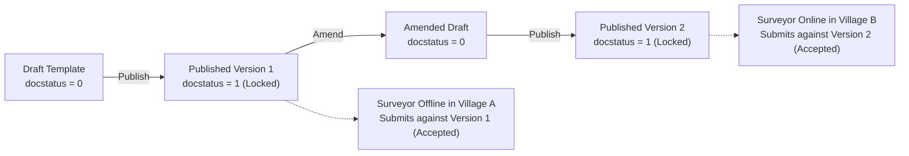
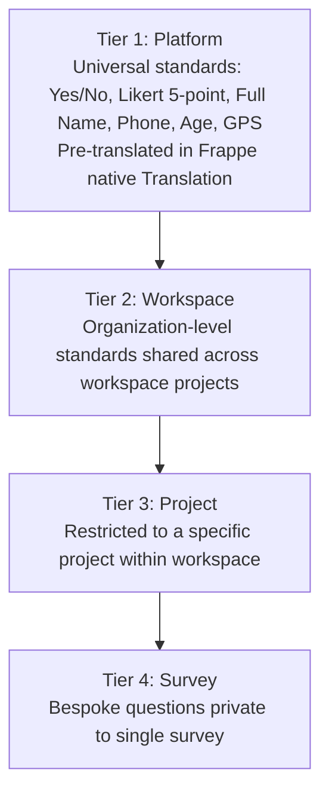
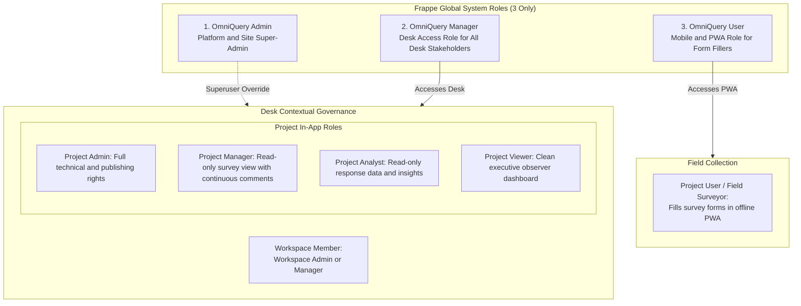
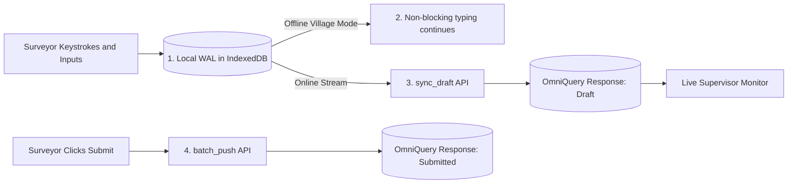
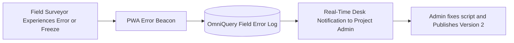

# <span style="font-family:'Roboto',sans-serif;font-weight:900;"><span style="color:#4285f4;">Omm</span><span style="color:#34a853;">No</span><span style="color:#ea4335;">M</span><span style="color:#fbbc05;">i</span></span> OmniQuery — System Architecture & Developer Guide

> **Scope**: System architecture, survey version lifecycle, 4-tier question master scoping, pure-configuration field taxonomy, continuous audio recording, in-flight live synchronization, Raven-style in-app SaaS role governance, disaster recovery, and engineering invariants for OmniQuery developers.

---

## 1. System Overview & High-Level Architecture

OmniQuery is an enterprise-grade, offline-first survey engine, dynamic inspection framework, and operational intelligence platform designed for bandwidth-constrained, rural, and large-scale enumeration environments.

```
┌─────────────────────────────────────────────────────────────────────────────────┐
│                      OmniQuery PWA Client (/omniquery)                          │
│  - Vue 3 + Tailwind CSS (Reactive, Accessible, Zero Uncontrolled Purple Bleed)  │
│  - Dexie.js Write-Ahead Log (IndexedDB: OmniQueryDB)                           │
│  - Universal Form Renderer & Control Dispatcher (Pure Schema Configuration)     │
│  - Continuous Ambient Audio Recording (MediaStream Opus Blobs)                 │
│  - Universal Disaster Recovery Drawer (JSON, XLSX, Forensic ZIP Bundle)         │
│  - Real-Time Error Reporting Beacon (sendBeacon / window.onerror)               │
└───────────────────────────────┬─────────────────────────────────────────────────┘
                                │
        ┌───────────────────────┴───────────────────────┐
        │                                               │
   In-Flight Live Draft Stream                   Final Batch Push
   (Debounced 750ms, Partial)              (UUIDv4 Idempotent Token)
        │                                               │
        ▼                                               ▼
┌─────────────────────────────────────────────────────────────────────────────────┐
│                     Frappe v16 Backend (OmniQuery Core)                         │
│  - Endpoints: `sync_draft` (Live Drafts) & `batch_push` (Atomic Finalization)  │
│  - Telemetry Endpoint: `log_field_error` (Instant Field Error Logging)          │
│  - Survey Version Engine (is_submittable: 1, Immutability Lock)      │
│  - 4-Tier Scope Hierarchy (Platform, Workspace, Project, Survey)                │
│  - 100% Frappe Native Translation (locale/*.csv & Translation DocType)          │
│  - Raven-Style In-App Contextual Membership (3 Global Frappe Roles)             │
│  - Native ORM / PyPika Queries (Zero Raw SQL Invariant)                         │
│  - Atomic MariaDB Savepoints (`sp_sync_<uuid>`) & Sync Audit Logs               │
└─────────────────────────────────────────────────────────────────────────────────┘
```

---

## 2. Survey Versions & Native Frappe Amendment Lifecycle (`is_submittable: 1`)

To prevent offline data corruption and schema divergence during multi-month field campaigns, survey templates adopt **Frappe's default Submittable Document Amendment Lifecycle**:



1. **Permanent Template Immutability**:
   - Setting `"is_submittable": 1` ensures that once a survey template is published (`docstatus = 1`), its schema, sections, and linked questions are permanently locked in MariaDB.
   - Any attempt to directly alter a published template raises `frappe.ValidationError`.
2. **Frappe Default Submittable Amendment (`amended_from`)**:
   - When survey questions, options, or scripts need updates during an active enumeration campaign, the Project Admin clicks **Amend**.
   - Built on Frappe's standard amendment system, Frappe automatically generates a sequential amended version (`SURV-TMPL-001-1`, `SURV-TMPL-001-2`) linked via `amended_from` without custom versioning hacks.
3. **Zero Offline Rejection Guarantee**:
   - Field surveyors offline in remote villages without network access continue collecting responses against Version 1.
   - When returning to connectivity, their responses are ingested cleanly without rejection or version mismatch errors. Both Version 1 and Version 2 responses coexist harmoniously in MariaDB.

---

## 3. 4-Tier Scope Hierarchy & Question Masters

Question Masters and Option Sets are decoupled from individual surveys and governed by a unified **4-Tier Scope**:



* **Platform Promotion**: System Administrators can promote widely used questions or option sets to `Platform` scope so no future tenant or project has to reinvent or re-translate them.
* **Active Status Filtering**: Every Question and Option Set carries a `status` (`Active`, `Inactive`, `Draft`). Inactive records are automatically filtered out from survey designer pickers.
* **100% Frappe Native Translation**: Questions, option labels, and instructions use Frappe's standard `locale/*.csv` and the native `Translation` DocType (`frappe._()`), completely eliminating hardcoded 4,000-line translation dictionaries.
* **Per-Survey Mandatory Flexibility**: `is_mandatory` is defined per survey version in the linking child table (`OmniQuery Template Question Reference`), allowing question `phone` to be optional in Version 1 and mandatory in Version 2.

---

## 4. Pure Configuration Field Type Taxonomy (Zero CSS Hacks)

All UI controls are driven deterministically by schema metadata without custom CSS overrides:

| Category | UI Variants & Capabilities | Schema Controls |
| :--- | :--- | :--- |
| **Choice (Single)** | Radio, Buttons, Switch (ON/OFF), Chips, Rating (Stars, Faces, Hearts, Thumbs with configurable 5/10 max and 1.0 or 0.5 step precision), Searchable Combobox (`f-combobox`) | `control_variant`, `options_set`, `rating_icon`, `rating_max`, `rating_step`, `default_value` |
| **Choice (Multi)** | Checkbox list, Multi-select chips, Grouped / Hierarchical category tags | `min_selections`, `max_selections`, `options_set` |
| **Numerical** | Integer, Decimal, Currency (with prefix ₹/$/€), Signed (+/-), Percentage, Range Slider with custom steps | `decimal_precision` (default `0`), `min_value`, `max_value`, `step`, `currency_symbol`, `allow_negative` |
| **Temporal** | Date, Time, DateTime, **Month-Year** (e.g. "Jan 2024"), **Year Only** (e.g. "2021"), **Day Only** | `temporal_granularity` (Date, Month-Year, Year, Day), `anchor_date_rule` (`First Day` e.g. `2024-01-01` or `Last Day` e.g. `2024-01-31` for seamless time-series chart plotting) |
| **Duration** | Hours:Minutes, Elapsed stopwatch timer, Days | `format`, `auto_stop` |
| **Geographic** | Latitude, Longitude, Pinpoint Map (Lat/Long + Accuracy), Polygon boundary capture | `precision`, `require_gps_accuracy_meters` |
| **Text Input** | Single-line Text, Small Text, Multi-line Textarea, Markdown / Rich text | `max_length`, `regex_pattern`, `placeholder` |
| **SubTable / Grid** | Tabular dynamic grid with child rows & columns, with support for nested sub-columns (e.g. Peak/Lean seasonal turnover breakdown) | `columns_schema_json`, `min_rows`, `max_rows` |
| **Media & Audio Interview** | Camera/Gallery Photo (`.webp`), Compressed Video (`.mp4`/`.webm`), and **Continuous Background Survey Audio Recording** (Floating header bar: `[🎙️ Record | ⏸ Pause / ▶ Resume | ⏹ Stop]` with automatic finalization & stop on survey submission) | `media_type` (Audio, Video, Photo), `media_source` (Live Camera/Mic or Gallery), `compression_quality`, `enable_interview_audio` |

---

## 5. SaaS Role Governance & Raven-Style In-App Contextual Membership

OmniQuery adopts a clean **Raven-style in-app membership architecture**: instead of polluting Frappe's global role namespace with dozens of granular roles, OmniQuery defines **only 3 global Frappe Roles**, while granular project permissions are governed by built-in Workspace & Project membership tables:



### 1. The 3 Global Frappe Roles
- **`OmniQuery Admin`**: Platform super-administrator with unrestricted access to settings, platform questions, fixtures, and tenant billing.
- **`OmniQuery Manager`**: Standard Frappe Desk role assigned to all Desk stakeholders (Workspace Admin, Workspace Manager, Project Admin, Project Manager, Project Analyst, Project Viewer).
- **`OmniQuery User`**: Dedicated mobile role for field enumerators filling forms in the PWA (`/omniquery`).

### 2. In-App Contextual Membership Model
- **`OmniQuery Workspace Member`**:
  - `user` (Link: `User`), `workspace_role` (`Workspace Admin`, `Workspace Manager`, `Workspace Member`).
- **`OmniQuery Project Member`**:
  - `user` (Link: `User`), `project_role`:
    - **`Project Admin`**: Full technical control; authors questions, configures scripts, tunes validation formulas, and publishes survey versions.
    - **`Project Manager`**: Operations lead; inspects survey structures in **read-only mode** with **continuous commenting & feedback privileges** on questions and sections; manages quotas, surveyor allocations, and collection pacing.
    - **`Project Analyst`**: Data researcher; read-only access to response data and telemetry for charts, Frappe Insights dashboards, and dataset exports (zero schema modification rights).
    - **`Project Viewer`**: Client executive observer; clean UI watching overall project KPIs, completion stats, and formal milestone reports.
    - **`Project User`**: Field enumerator collecting survey data in PWA.

### 3. Native Frappe Permission Hook Integration
- **`has_permission(doc, ptype, user)`**:
  - Automatically grants full access if user is `OmniQuery Admin` or `System Manager`.
  - For `OmniQuery Template` edits: verifies user has `project_role == "Project Admin"` in `doc.project`.
  - For `OmniQuery Response` reads/exports: verifies user has `project_role in ["Project Admin", "Project Manager", "Project Analyst", "Project Viewer"]`.
  - For `OmniQuery Response` draft submissions: verifies user is in `OmniQuery Project Member` with `project_role in ["Project User", "Project Admin"]`.
- **`permission_query_conditions(user)`**:
  - Generates SQL conditions for `frappe.get_list` so users only see records belonging to Projects where they hold an active membership.

---

## 6. Continuous In-Flight Live Sync & Offline Village Mode



1. **Immediate Local WAL**: Every keystroke/selection is saved to Dexie IndexedDB with `sync_status = "Draft"`.
2. **Non-Blocking In-Flight Stream**: When online, debounced background worker posts partial state to `sync_draft`. Server updates `OmniQuery Response` and `OmniQuery Response Item` without failing on mandatory fields.
3. **Background Interview Audio Recording**:
   - Top-bar persistent audio recorder captures interview ambient audio in low-bitrate Opus chunks (`.webm` / `.opus`).
   - Recorded audio streams directly into IndexedDB blobs without interrupting data synchronization.

---

## 7. Instantaneous Client Error Reporting Beacon

To guarantee that field surveyors never remain stuck in the field unnoticed:



1. **Zero-Latency Error Capture**:
   - PWA catches unhandled promise rejections, script evaluation errors, or input parsing issues instantaneously.
   - Dispatches an asynchronous non-blocking error beacon (`navigator.sendBeacon('/api/method/omniquery.api.telemetry.log_field_error')`).
2. **`OmniQuery Field Error Log` DocType**:
   - Stored on the server: `survey_template`, `template_version`, `question_code` (exact question where error happened), `surveyor`, `error_message`, `stack_trace`, and `device_info`.
3. **Rapid Triage & Patching**:
   - Project Admins see real-time field error logs directly in `/desk/omniquery-workstation`.
   - Admin can amend the template, fix the question script/options, and publish Version 2. The surveyor's PWA automatically picks up the fix on its next heartbeat.

---

## 8. Disaster Recovery & Universal Local Export (Per-Survey & Bulk All-At-Once)

To guarantee **zero data loss under any technical failure** (server downtime, corrupted cache, device hardware issues):

1. **PWA Local Storage Recovery Drawer**:
   - Accessible via the top status pill at any time, even when completely offline.
   - Provides instant switching between **Per-Survey Export** and **Bulk Action Export (All At Once)**.
2. **Dual-Scope Recovery Modes**:
   - **Per-Survey Export**: Extracts responses, answered fields, and media strictly for the active or selected survey.
   - **Bulk Action Export (All At Once)**: Master one-click extraction of all surveys, offline responses, audio recordings, and photos stored on the device.
3. **Multi-Format Export Options**:
   - **`JSON Export`**: Complete, cryptographic raw dump of IndexedDB (WAL, draft state, schema hashes).
   - **`XLSX Export`**: Formatted tabular workbook containing all responses, sections, and answered columns ready for Excel (multi-tab in bulk mode).
   - **`Comprehensive Forensic ZIP Bundle`**:
     - `survey_database_dump.json`: Raw IndexedDB WAL state.
     - `responses_spreadsheet.xlsx`: Tabular survey data.
     - `media/`: All captured photos (`.webp`), compressed videos (`.webm`/`.mp4`), and interview audio blobs (`.opus`).
     - `diagnostics/console_logs.txt`: Complete in-memory circular ring buffer of client console logs & errors.
     - `diagnostics/device_telemetry.json`: OS, browser engine, screen DPI, battery level, online/offline transition history, and storage quota utilization.
4. **Out-of-Band Sharing**:
   - Web Share API / File Saver: Surveyors can send the ZIP directly to supervisors via WhatsApp, Telegram, Google Drive, or Bluetooth.

---

## 9. Engineering Invariants & Code Standards

### The 10-Line Function Invariant
- **Rule**: No function may exceed **10 lines** in length.
- **Why**: Keeps functions easily readable, mathematically verifiable, unit-testable, and prevents regression sprawl.
- **Decomposition Pattern**: Complex logic must be split into:
  1. Extraction / Normalization helper (2–5 lines)
  2. Pure transformation / Business rule helper (3–7 lines)
  3. Action / Execution helper (3–8 lines)

### Configuration-Driven Architecture
- Survey grids, question groupings, and field-type characteristics are defined in structured declarative objects (e.g. `GRID_CONFIGS`, `MULTI_SELECT_CODES`).
- Templates reference configuration via lookup helpers rather than inline hardcoded conditionals.

### Honest Status Invariant
- Toast and UI indicators must reflect true transactional state. If a server sync yields HTTP 400 (e.g. CSRFTokenError) or database rejection, the WAL item remains `PENDING_SYNC` and the notification must explicitly state `Sync failed for X survey(s)`. Never report false success.

### 🔒 Security & Zero Raw SQL Invariant
- **Absolute Rule**: **NEVER write raw SQL (`frappe.db.sql`)**.
- **Rationale**: Raw SQL bypasses Frappe's field-level permissions, role-based access control (RBAC), tenant isolation, parameter sanitization, and DocType event hooks.
- **Mandatory Frappe Native APIs**:
  - `frappe.get_doc(doctype, name)` / `frappe.new_doc(doctype)`
  - `frappe.get_all(doctype, filters=..., fields=..., order_by=..., limit=...)`
  - `frappe.get_list(doctype, filters=...)` (strict permission-enforced listing)
  - `frappe.db.get_value(doctype, filters, fieldname)`
  - `frappe.db.exists(doctype, name_or_filters)`
  - `frappe.db.set_value(doctype, name, fieldname, value)`
  - `frappe.qb` (Frappe Query Builder via PyPika) with parameterized builders if complex set-level queries are required.
- **CSRF & Session Invariant**: All state-mutating requests must pass through Frappe's native session validation using `frappe.sessions.get_csrf_token()` and `X-Frappe-CSRF-Token` headers. Unsafe bypasses (`ignore_csrf`) are strictly prohibited.

### Zero DB-Pollution Test Suite Invariant
- **FrappeTestCase Integration**: All backend unit tests inherit from `frappe.tests.utils.FrappeTestCase`.
- **Automatic Rollback / Teardown**: Tests that instantiate dummy templates, surveyors, or responses must either execute in non-committing transactions or clean up all records inside `tearDown()`, ensuring development databases and team workstations remain spotless.

---

<small>© 2026 OmmNoMi Automation LLP · Mahunag · Karsog · Mandi, HP, India</small>
