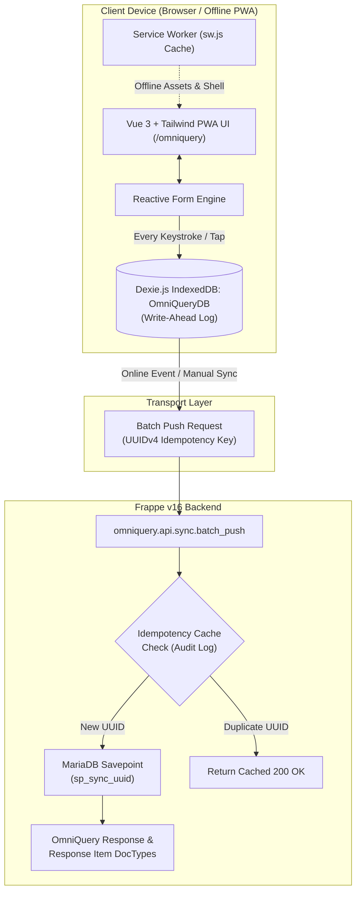

<div align="center">

# <span style="font-family:'Roboto',sans-serif;font-weight:900;"><span style="color:#4285f4;">Omm</span><span style="color:#34a853;">No</span><span style="color:#ea4335;">M</span><span style="color:#fbbc05;">i</span></span> OmniQuery

**Next-Gen Dynamic Survey Engine, Zero-Data-Loss Offline PWA & Frappe Insights Platform**

[](https://opensource.org/licenses/MIT)
[](https://frappeframework.com)
[](https://www.python.org/)
[](https://github.com/astral-sh/ruff)
[](https://github.com/pre-commit/pre-commit)
[](https://omniquery.ommnomi.com)

[Explore Features](#key-features) · [Quick Start](#quick-start) · [Architecture](#architecture) · [Accessibility](#keyboard-navigation--accessibility) · [Contributing](#contributing)

</div>

---

## 🌟 Overview

**OmniQuery** is an enterprise-grade, offline-first survey and inspection platform built for [Frappe Framework v16](https://frappeframework.com). Engineered specifically for rigorous field research, social audits, agricultural censuses, and operational checklists, OmniQuery guarantees **zero data loss** in bandwidth-constrained, rural, or fully offline field environments.

With an embedded Progressive Web App (PWA) running on Dexie.js (IndexedDB Write-Ahead Logging), client-side UUIDv4 idempotency keys, and an atomic MariaDB backend ingestion pipeline, field surveyors can capture hundreds of complex multi-section responses without ever fearing browser reloads, network drops, or duplicate submissions.

---

## 🚀 Key Features

* **🛡️ Zero-Data-Loss Offline PWA**: Dual-tier storage with in-memory state and persistent IndexedDB Write-Ahead Log (WAL). Forms survive battery depletion, background app eviction, and accidental navigation.
* **🔁 Client-Side Idempotency**: Every survey submission generates a cryptographically random UUIDv4 token with an atomic MariaDB savepoint (`sp_sync_<uuid>`), completely eliminating duplicate responses on spotty 2G/3G connections.
* **♿ WCAG 2.2 AA Keyboard & Screen Reader Accessibility**:
  * Single-tab-group range controls with WAI-ARIA roving tabindex (`role="radiogroup"`, `role="radio"`).
  * Smooth keyboard navigation via <kbd>ArrowLeft</kbd>, <kbd>ArrowRight</kbd>, <kbd>Home</kbd>, and <kbd>End</kbd>.
  * Live status announcements via non-interactive `#cv-live-region`.
* **🌐 Dynamic Multilingual Engine**: Instant client-side switching between English, Hindi, and regional dialects with instant UI re-rendering and fallback mechanisms.
* **📍 GIS Geo-fencing & Surveyor Telemetry**: Captures high-accuracy GPS coordinates, accuracy radii, device battery level, and timestamp signatures at submission time.
* **⚙️ Declarative Schema Engine**: Dynamic rendering of over 25+ question formats including numeric sliders, rating pills, multi-select action grids, cascading parent-child lookups, date/time pickers, and signature pads.
* **📊 Frappe Native ORM & Insights**: 100% Frappe native ORM queries without raw SQL, providing automatic role-based permission query conditions (RBAC) and clean Frappe Insights readiness.

---

## 📐 Architecture



For complete technical specifications, see [ARCHITECTURE.md](ARCHITECTURE.md) and [ROADMAP.md](ROADMAP.md).

---

## ⚡ Quick Start

### Prerequisites

* Frappe Bench installed with Python 3.10+ and Node.js 18+
* MariaDB 10.6+ or 11.4+
* Redis (Cache & Queue)

### Bench Installation

```bash
# Navigate to your bench root directory
cd ~/frappe-bench

# Fetch the OmniQuery app into bench
bench get-app https://github.com/OmmNoMi/omniquery.git --branch develop

# Install OmniQuery onto your target site
bench --site your-site.local install-app omniquery

# Build frontend production assets
bench build --app omniquery

# Clear cache and run database migrations
bench --site your-site.local migrate
bench --site your-site.local clear-cache
```

### Launching the PWA

Once installed, navigate directly to the standalone Progressive Web App in your browser:

```
http://your-site.local:8000/omniquery
```

Or click the **OmniQuery** app tile on the Frappe Desk apps launcher.

---

## ♿ Keyboard Navigation & Accessibility

OmniQuery strictly adheres to **WCAG 2.2 AA** non-text contrast and roving tabindex standards:

| Control | Key | Action |
| :--- | :--- | :--- |
| **Numeric Range / Rating Pills** | <kbd>Tab</kbd> | Focuses into the active value in the button row (treated as a single tab stop). |
| | <kbd>→</kbd> / <kbd>↓</kbd> | Increments value and shifts active radio focus. |
| | <kbd>←</kbd> / <kbd>↑</kbd> | Decrements value and shifts active radio focus. |
| | <kbd>Home</kbd> | Jumps immediately to minimum step. |
| | <kbd>End</kbd> | Jumps immediately to maximum step. |
| **Form Fields** | <kbd>/</kbd> | Jumps focus to the primary input filter. |
| **Global Desk** | <kbd>⌘K</kbd> / <kbd>Ctrl+K</kbd> | Native Frappe Awesomebar search. |

---

## 🧪 Testing & Code Quality

OmniQuery enforces high code quality through automated test suites and pre-commit hooks.

### Running Test Suites

```bash
# Run server-side unit & idempotency tests
bench --site your-site.local run-tests --app omniquery

# Run specific idempotent sync test
bench --site your-site.local run-tests --app omniquery --module omniquery.tests.test_idempotent_sync
```

### Code Formatting & Linters

OmniQuery uses [Ruff](https://github.com/astral-sh/ruff) for Python linting and import sorting, and Prettier/ESLint for web assets:

```bash
# Install pre-commit hooks locally
cd apps/omniquery
pre-commit install

# Run linters manually across all files
pre-commit run --all-files
```

---

## 🤝 Contributing

We welcome community contributions, bug reports, and enhancements! Please read our [CONTRIBUTING.md](CONTRIBUTING.md) guide and [CODE_OF_CONDUCT.md](CODE_OF_CONDUCT.md) before submitting pull requests.

1. Fork the repository on GitHub.
2. Create a feature branch (`git checkout -b feat/dynamic-lookup-filters`).
3. Commit your changes following [Conventional Commits](https://www.conventionalcommits.org/) (`git commit -m "feat: add dynamic cascading lookup filters"`).
4. Verify all tests pass locally (`bench run-tests --app omniquery`).
5. Open a Pull Request against the `develop` branch.

---

## 🔒 Security

For security advisories or vulnerability reports, please review our [SECURITY.md](SECURITY.md) policy or contact our security team directly at **[omniquery@ommnomi.com](mailto:omniquery@ommnomi.com)**.

---

## 📄 License

This project is licensed under the **MIT License** — see the [LICENSE](LICENSE) file for details.

---

<div align="center">
  <small>Mahunag · Karsog · Mandi, HP, India · <strong>OmmNoMi Automation LLP</strong></small>
</div>
